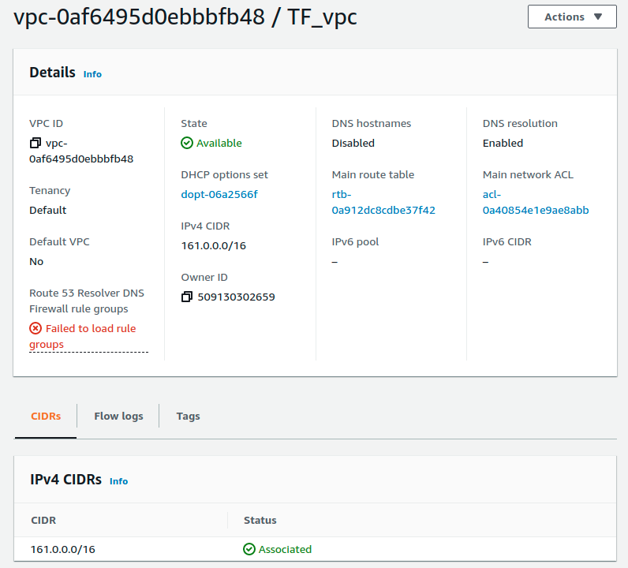
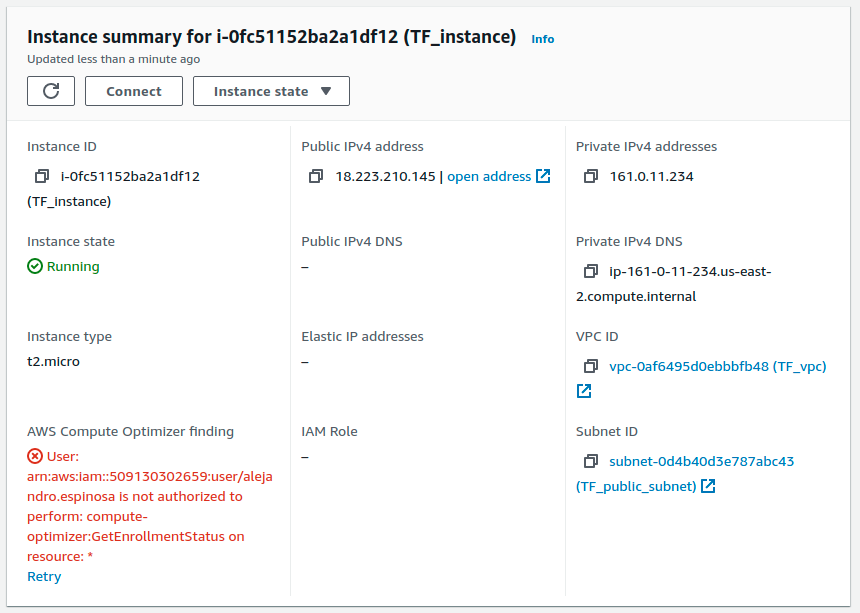
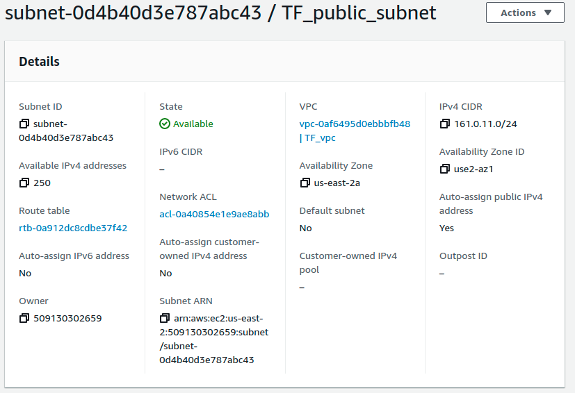
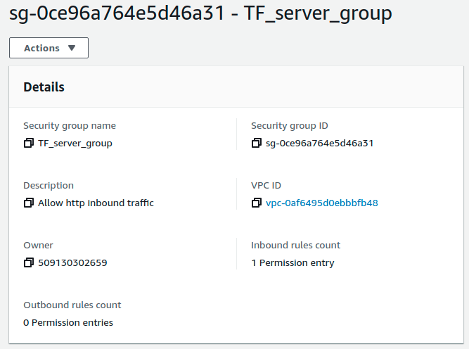
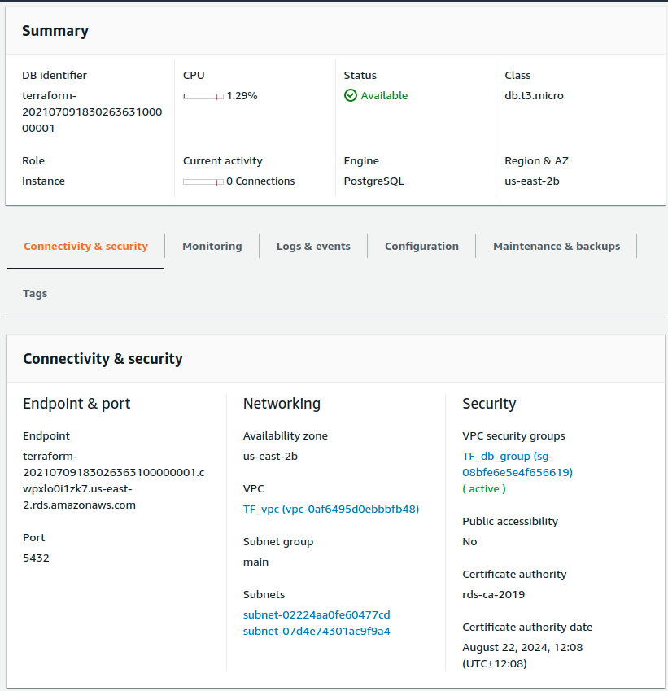
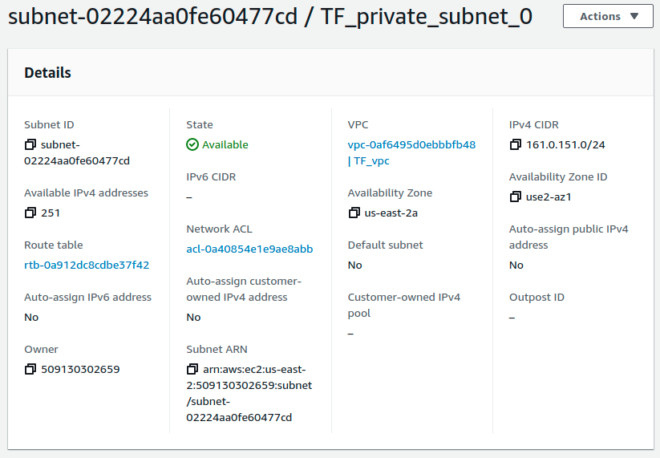
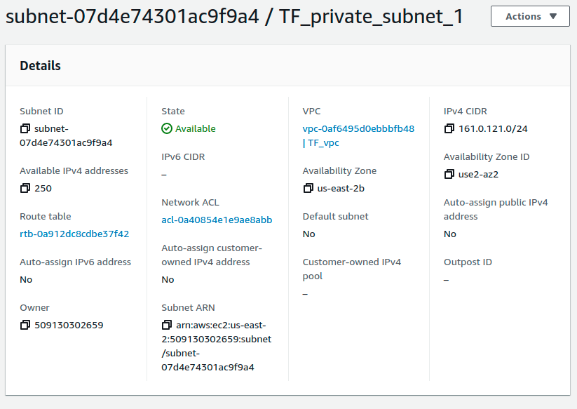
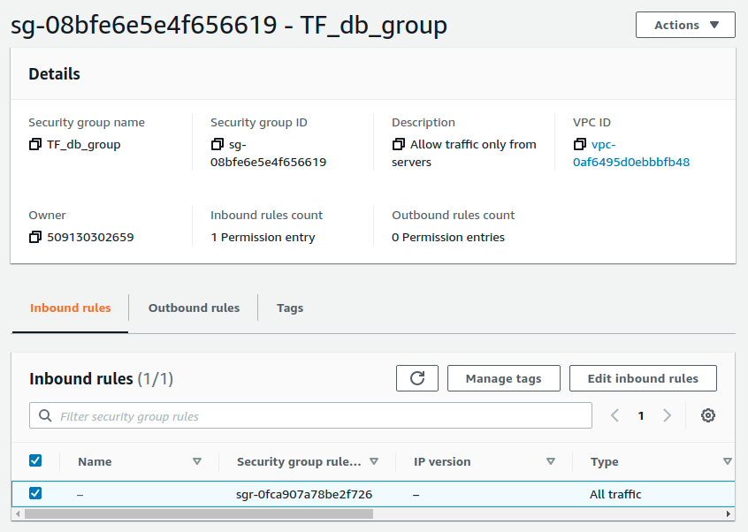
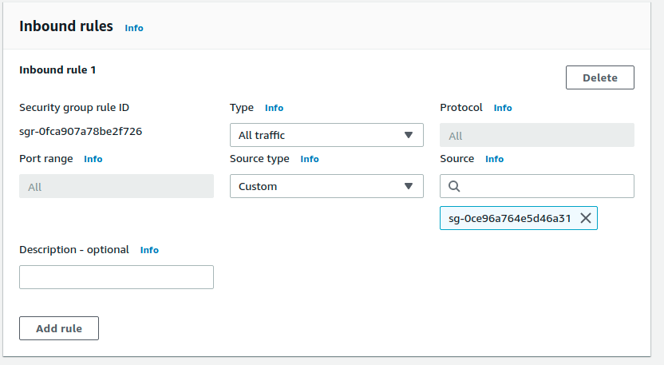

# Terraform Beginner

This is a simple terraform exercise.

## AWS deployment

For AWS, secrets are provided via environment variables to avoid revealing keys.

### Deployed components

The dployed components are:

#### VPC
VPC deploys a main vpc, along with subnets, and security groups to organize the infrastructure.

#### EC2
A public server is deployed in a subnet with internet access, and a security group allows for these to be the only component that can access the database.

##### Public Subnet
Public subnet for internet access

##### Security Group
this security group allows for access from the internet.

#### RDS
A simple postgres database is deployed, using a subnets and security groups to avoid ingress from the internet.

##### Private Subnets
Private subnets for the database.

##### Security Group
This security group, and its security rule allow for secure access

###### Security Group Rule
This rule allows for access only from the server group

